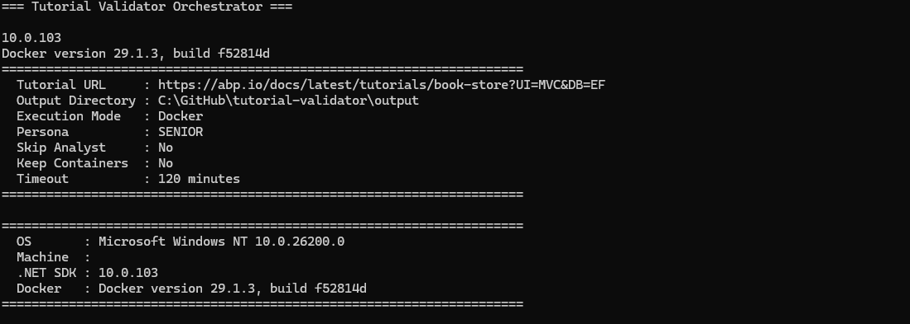
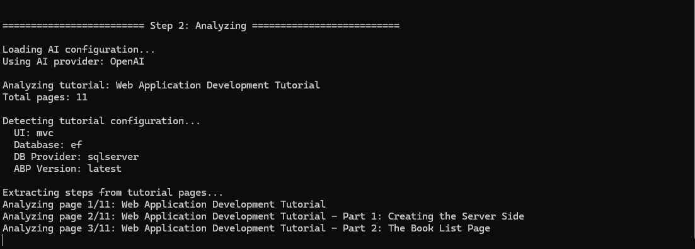
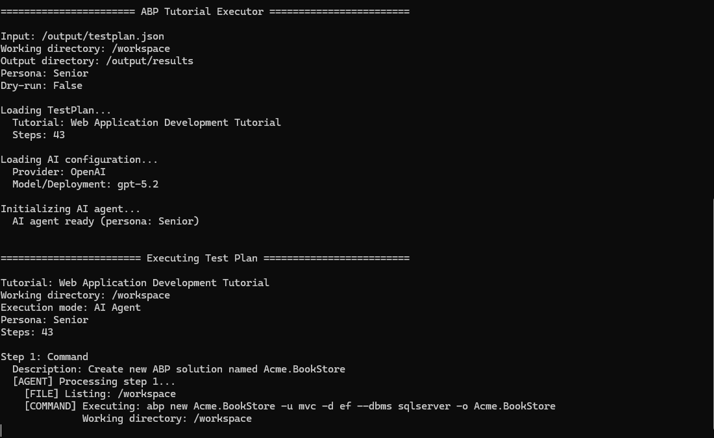

# TutorialValidator

[](LICENSE)
[](https://dotnet.microsoft.com/download/dotnet/10.0)

TutorialValidator is an AI-powered tool that checks whether a software documentation tutorial actually works. You give it a URL, it scrapes the tutorial, turns every instruction into an executable step, then runs those steps exactly as a developer would — installing packages, writing files, running commands, making HTTP calls, and asserting results.

We originally built it internally to validate [ABP Framework](https://abp.io) tutorials, and then decided to publish it as open source so you can use it to validate any publicly accessible tutorial.

## See It in Action

The following screenshots show the three main phases of a validation run.

**Orchestrator** — coordinates the full pipeline, launching the Analyst and Executor in sequence and collecting the final results.



**Analyst** — scrapes the tutorial pages and uses AI to extract every instruction into a structured, executable test plan.



**Executor** — works through the test plan step by step, running commands, writing files, and asserting outcomes just as a real developer would.



---

## Prerequisites

Before you start, make sure you have the following installed:

| Tool | Version | Where to get it |
|---|---|---|
| .NET SDK | 10.0 | [dotnet.microsoft.com](https://dotnet.microsoft.com/download/dotnet/10.0) |
| Docker Desktop | Latest | [docker.com/get-started](https://www.docker.com/get-started/) |
| AI provider API key | — | Refer to your AI provider's documentation |

> Docker is required for the default (recommended) execution mode. If you want to run without Docker, see [Running Locally Without Docker](#running-locally-without-docker) below.

---

## Quick Start (Docker — Recommended)

Docker mode runs the tutorial execution inside an isolated container, so nothing being tested affects your machine.

**Step 1 — Clone the repository**

```bash
git clone https://github.com/AbpFramework/TutorialValidator.git
cd TutorialValidator
```

**Step 2 — Create your environment file**

```bash
cp docker/.env.example docker/.env
```

**Step 3 — Add your API key**

Open `docker/.env` in any text editor and fill in your AI provider credentials. For example:

```env
# OpenAI
OPENAI_API_KEY=sk-...
OPENAI_MODEL=gpt-5.2

# OpenAI-Compatible (works with providers that expose an OpenAI-compatible API)
# OPENAI_COMPAT_BASE_URL=https://your-provider.example.com/v1
# OPENAI_COMPAT_API_KEY=your-key
# OPENAI_COMPAT_MODEL=gpt-4o-mini
# AI_PROVIDER=OpenAICompatible

# Azure OpenAI
AZURE_OPENAI_ENDPOINT=https://your-resource.openai.azure.com/
AZURE_OPENAI_API_KEY=your-key
AZURE_OPENAI_DEPLOYMENT=gpt-4o
AI_PROVIDER=AzureOpenAI
```

See [Environment Variables](#environment-variables) for all supported providers.

**Step 4 — Run the validation**

```bash
dotnet run --project src/Validator.Orchestrator -- run \
  --url "https://docs.abp.io/en/abp/latest/Tutorials/Todo/Index" \
  --output ./output
```

Replace the URL with any tutorial you want to test. The tool will scrape the page and any linked pages in the same tutorial series, then begin execution. The whole process typically takes 10–30 minutes depending on tutorial length and the model you are using.

**Step 5 — Review the results**

When the run finishes, your output directory will contain:

```
output/
├── scraped/                  # Markdown version of the scraped tutorial pages
├── testplan.json             # Structured list of steps extracted from the tutorial
├── results/
│   ├── validation-result.json   # Step-by-step pass/fail results
│   └── validation-report.json   # Detailed report with diagnostics
├── logs/                     # Full execution logs
└── summary.json              # Overall pass/fail summary
```

Exit code `0` means the tutorial passed. Exit code `1` means at least one step failed.

---

## Running Locally Without Docker

If you prefer not to use Docker (for example, if you already have the required tools installed on your machine), you can run everything locally.

**Step 1 — Add your API key to appsettings**

Open `src/Validator.Orchestrator/appsettings.json` and fill in the `AI` section with your credentials, or set environment variables instead (see [Environment Variables](#environment-variables)).

**Step 2 — Run with the `--local` flag**

```bash
dotnet run --project src/Validator.Orchestrator -- run \
  --url "https://docs.abp.io/en/abp/latest/Tutorials/Todo/Index" \
  --output ./output \
  --local
```

> **Note:** In local mode, the Executor runs commands directly on your machine. Make sure any tools the tutorial requires (such as the ABP CLI, Node.js, or a database) are already installed.

---

## Running Individual Phases

You do not have to run the full pipeline every time.

**Generate a test plan without executing it (Analyst only)**

Useful for inspecting what the AI extracted from the tutorial before you commit to a full run.

```bash
dotnet run --project src/Validator.Analyst -- full \
  --url "https://docs.abp.io/en/abp/latest/Tutorials/Todo/Index" \
  --output ./output
```

**Execute an existing test plan (Executor only)**

If you already have a `testplan.json` — either from a previous Analyst run or hand-crafted — you can execute it directly:

```bash
dotnet run --project src/Validator.Executor -- run \
  --input ./output/testplan.json \
  --workdir ./workspace \
  --output ./output/results \
  --persona mid
```

**Run the Executor in Docker against an existing test plan**

```bash
dotnet run --project src/Validator.Orchestrator -- docker-only \
  --testplan ./output/testplan.json \
  --output ./output
```

---

## Developer Personas

The `--persona` flag controls how the AI agent behaves when it encounters problems. Think of it as the experience level of the developer following your tutorial.

| Persona | What it simulates | On error |
|---|---|---|
| `junior` | A developer who follows instructions exactly as written, no problem-solving | Stops and reports immediately |
| `mid` | A developer familiar with the tech stack but new to this framework (default) | Stops and reports immediately |
| `senior` | An expert who can diagnose and fix issues autonomously | Retries up to 3 times, documents every fix |

```bash
dotnet run --project src/Validator.Orchestrator -- run \
  --url "https://docs.abp.io/en/abp/latest/Tutorials/Todo/Index" \
  --persona senior
```

Use `junior` or `mid` to find actual documentation gaps. Use `senior` to validate the overall flow and identify which problems are fixable by an experienced developer.

---

## Configuration and Options

### appsettings.json

The file at `src/Validator.Orchestrator/appsettings.json` controls all default settings. Every value can also be overridden with an environment variable (see [Environment Variables](#environment-variables) below).

```json
{
  "AI": {
    "Provider": "OpenAI",
    "Model": "gpt-5.2",
    "DeploymentName": "gpt-5.2",
    "ApiKey": ""
  },
  "Docker": {
    "ComposeFile": "../docker/docker-compose.yml",
    "SqlServerPassword": "YourStrong!Password123"
  },
  "Orchestrator": {
    "DefaultOutputPath": "./output",
    "KeepContainersAfterRun": false,
    "TimeoutMinutes": 60
  },
  "Email": {
    "Enabled": true,
    "SmtpHost": "localhost",
    "SmtpPort": 2525,
    "UseSsl": false,
    "Username": "",
    "Password": "",
    "FromAddress": "tutorial-validator@localhost",
    "FromName": "Tutorial Validator",
    "ToAddresses": ["your-email@example.com"]
  },
  "Discord": {
    "Enabled": true,
    "WebhookUrl": ""
  }
}
```

#### AI section

| Field | Description |
|---|---|
| `Provider` | AI provider to use. Accepted values: `OpenAI`, `AzureOpenAI`, `OpenAICompatible`. Auto-detected from environment variables if omitted. |
| `Model` | The model name to request from your AI provider (e.g. `gpt-5.2`, `gpt-4o`). Ignored when using Azure OpenAI. |
| `DeploymentName` | The deployment name for Azure OpenAI. When using OpenAI directly, this can mirror the `Model` value or be left empty. |
| `ApiKey` | Your AI provider API key. Leave blank and use environment variables (`OPENAI_API_KEY`, `AZURE_OPENAI_API_KEY`, or `OPENAI_COMPAT_API_KEY`) instead — do not commit keys to source control. |
| `BaseUrl` | Base URL for OpenAI-compatible providers (e.g. `https://your-provider.example.com/v1`). Used when `Provider` is `OpenAICompatible`. |

#### Docker section

| Field | Description |
|---|---|
| `ComposeFile` | Path to the `docker-compose.yml` file. Relative to the Orchestrator project directory. |
| `SqlServerPassword` | The SA password for the SQL Server container. Must match the `MSSQL_SA_PASSWORD` value in `docker/.env`. |

#### Orchestrator section

| Field | Description |
|---|---|
| `DefaultOutputPath` | Default directory where all output files are written. Can be overridden with `--output`. |
| `KeepContainersAfterRun` | When `true`, Docker containers are not stopped after the run. Useful for debugging. Can be overridden with `--keep-containers`. |
| `TimeoutMinutes` | Maximum number of minutes the full pipeline is allowed to run before it is forcibly stopped. |

#### Email section

| Field | Description |
|---|---|
| `Enabled` | Set to `true` to send an HTML report email after each run. |
| `SmtpHost` | Hostname of your SMTP server. |
| `SmtpPort` | Port for the SMTP server. Common values: `25`, `465` (SSL), `587` (STARTTLS), `2525`. |
| `UseSsl` | Set to `true` to use SSL/TLS for the SMTP connection. |
| `Username` | SMTP authentication username. Leave blank if your server does not require authentication. |
| `Password` | SMTP authentication password. Leave blank if your server does not require authentication. |
| `FromAddress` | The sender email address that appears in the `From` field. |
| `FromName` | The display name that appears alongside the sender address. |
| `ToAddresses` | JSON array of recipient email addresses. |

#### Discord section

| Field | Description |
|---|---|
| `Enabled` | Set to `true` to post a notification to Discord after each run. |
| `WebhookUrl` | Your Discord incoming webhook URL. Create one in your Discord server's channel settings under Integrations. Leave blank to disable even if `Enabled` is `true`. |

---

### CLI Arguments

#### Orchestrator `run` command

The main command that runs the full pipeline (Analyst + Executor + Reporter).

```
dotnet run --project src/Validator.Orchestrator -- run [options]
```

| Flag | Short | Default | Description |
|---|---|---|---|
| `--url` | `-u` | — | URL of the tutorial to validate. Required unless `--skip-analyst` is used. |
| `--testplan` | `-t` | — | Path to an existing `testplan.json`. Used with `--skip-analyst` to skip the scraping phase. |
| `--output` | `-o` | `./output` | Directory where all output files are written. |
| `--config` | `-c` | — | Path to a custom `appsettings.json` file. Useful for CI or per-project configurations. |
| `--persona` | — | `mid` | Developer persona for the Executor agent. Values: `junior`, `mid`, `senior`. |
| `--local` | — | `false` | Run the Executor locally instead of inside a Docker container. |
| `--skip-analyst` | — | `false` | Skip the scraping and analysis phase. Requires `--testplan`. |
| `--keep-containers` | — | `false` | Keep Docker containers running after the run completes. Useful for inspecting container state. |
| `--timeout` | — | `60` | Maximum run time in minutes before the pipeline is stopped. |

#### Orchestrator `analyst-only` command

Runs only the Analyst phase (scrape + generate test plan). Does not execute any steps.

```
dotnet run --project src/Validator.Orchestrator -- analyst-only [options]
```

Accepts the same `--url`, `--output`, `--config` flags as the `run` command.

#### Orchestrator `docker-only` command

Runs only the Executor phase inside Docker against an existing test plan.

```
dotnet run --project src/Validator.Orchestrator -- docker-only [options]
```

Accepts `--testplan`, `--output`, `--config`, `--persona`, `--keep-containers`.

#### Analyst `full` command

Runs the Analyst standalone (scrape + analyze). Useful for generating or inspecting a test plan before running the Executor.

```
dotnet run --project src/Validator.Analyst -- full [options]
```

| Flag | Default | Description |
|---|---|---|
| `--url` | — | Tutorial URL to scrape. Required. |
| `--output` | `Output` | Directory for scraped content and `testplan.json`. |
| `--config` | — | Path to a custom `appsettings.json` for AI credentials. |
| `--max-pages` | `20` | Maximum number of tutorial pages to scrape. The Analyst follows navigation links within the same tutorial series up to this limit. Increase it for very long tutorials. |
| `--target-steps` | `50` | The Analyst compacts adjacent similar steps to keep the plan manageable. This is the target number of steps after compaction. The Analyst will try to reduce the plan to this count without losing information. |
| `--max-steps` | `55` | Hard upper limit on the number of steps. If the plan still exceeds this after normal compaction, a more aggressive compaction pass runs. Set higher values if you notice important steps being merged away. |

#### Executor `run` command

Executes an existing test plan directly, without Docker.

```
dotnet run --project src/Validator.Executor -- run [options]
```

| Flag | Default | Description |
|---|---|---|
| `--input` | — | Path to `testplan.json`. Required. |
| `--workdir` | Current directory | Working directory where the Executor creates files and runs commands. |
| `--output` | `results` | Directory for result files. |
| `--config` | — | Path to a custom `appsettings.json` for AI credentials. |
| `--persona` | `mid` | Developer persona. Values: `junior`, `mid`, `senior`. |
| `--dry-run` | `false` | Prints the steps that would be executed without actually running them. Useful for verifying a test plan before committing to a full run. |

---

### Environment Variables

Environment variables always override values in `appsettings.json`.

| Variable | Description |
|---|---|
| `OPENAI_API_KEY` | OpenAI API key. |
| `OPENAI_MODEL` | OpenAI model name (e.g. `gpt-5.2`, `gpt-4o`). |
| `OPENAI_COMPAT_BASE_URL` | Base URL for an OpenAI-compatible API endpoint. |
| `OPENAI_COMPAT_API_KEY` | API key for an OpenAI-compatible provider. |
| `OPENAI_COMPAT_MODEL` | Model name for OpenAI-compatible providers. |
| `OPENAI_COMPAT_ORG` | Optional organization ID for OpenAI-compatible providers. |
| `OPENAI_COMPAT_PROJECT` | Optional project ID for OpenAI-compatible providers. |
| `AZURE_OPENAI_ENDPOINT` | Azure OpenAI endpoint URL (e.g. `https://your-resource.openai.azure.com/`). |
| `AZURE_OPENAI_API_KEY` | Azure OpenAI API key. |
| `AZURE_OPENAI_DEPLOYMENT` | Azure OpenAI deployment name. |
| `AI_PROVIDER` | Force a specific provider: `OpenAI`, `AzureOpenAI`, or `OpenAICompatible`. Auto-detected if omitted. |
| `Discord__Enabled` | Enable Discord notifications: `true` or `false`. |
| `Discord__WebhookUrl` | Discord incoming webhook URL. |
| `EXECUTOR_BUILD_GATE_INTERVAL` | Senior persona only: run `dotnet build` every N steps as a sanity check. `0` disables this. |
| `ConnectionStrings__Default` | SQL Server connection string used inside the Docker executor container. |
| `EXECUTOR_WORKDIR` | Working directory for the executor container. Set automatically by `docker-compose.yml`. |

---

## Learn More

- [How It Works](HOW_IT_WORKS.md) — an accessible explanation of the pipeline, the AI agent, and what each phase does
- [Technical Reference](TECHNICAL_REFERENCE.md) — deep documentation covering architecture, schemas, plugin system, CI/CD integration, and how to extend the tool

---

## Contributing

Contributions are welcome. Please read [CONTRIBUTING.md](CONTRIBUTING.md) for development setup, branching conventions, coding standards, and the PR checklist.

---

## License

MIT License — Copyright (c) [Volosoft](https://volosoft.com).
See [LICENSE](LICENSE) for the full text.
